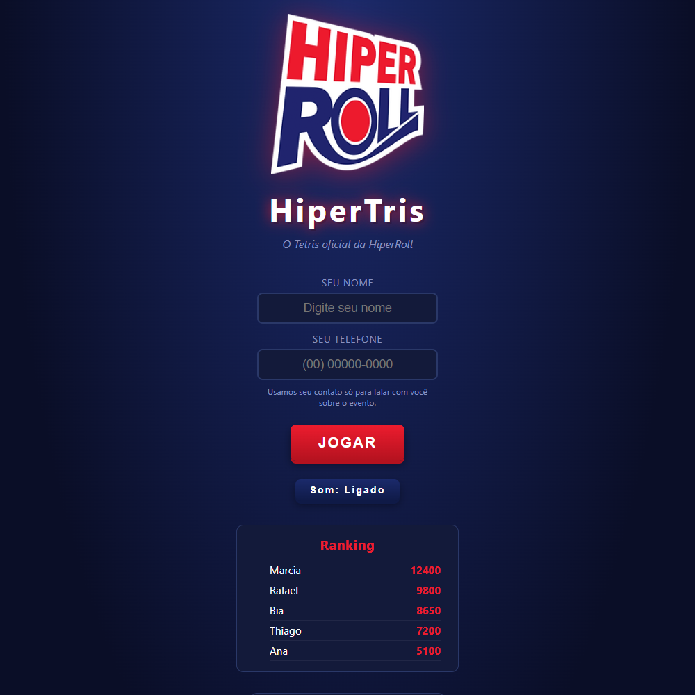
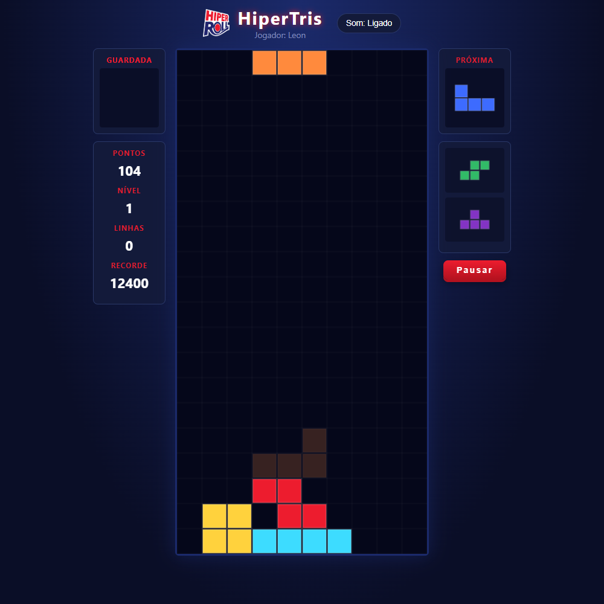

<div align="center">


# HiperTris

### O Tetris oficial da HiperRoll — feito pra brilhar em estande de evento




</div>

---

Sabe aquele Tetris que todo mundo já jogou em algum momento da vida? Pois
é, só que com a cara da HiperRoll, rodando liso em qualquer tela, tocando
uma trilha sonora que não enche o saco depois de 2 horas de estande ligado,
e ainda de quebra guardando o contato de quem jogou. Feito pra evento,
sem frescura, sem instalar nada — abre e joga.

## O que tem dentro

- **Tetris raiz**: as 7 peças, fila de próximas peças, peça fantasma
  (mostra onde vai cair), guardar peça (hold), pontuação, níveis que
  aumentam a velocidade e efeito de linha completa.
- **Cara da HiperRoll**: vermelho e azul da marca, logo em todo canto,
  responsivo de ponta a ponta — funciona igual bem num notebook, numa TV
  de estande ou no celular de quem tá passando.
- **Som sem cansar**: efeitos e uma trilha instrumental curtinha em loop,
  tudo gerado por código (nenhum arquivo de áudio pesado por aí). Tem
  botão de mudo, porque nem todo evento pede trilha sonora.
- **Nome na entrada**: pra jogar, a pessoa se identifica. No app desktop
  (evento) também se pede o telefone, pra usar depois num sorteio, numa
  campanha, no que fizer sentido pro time de marketing — no site, só o
  nome mesmo.
- **Ranking**: Top 10 de quem mais pontuou, visível na tela inicial e no
  menu de pausa (com direito a reiniciar a partida sem sair do jogo).
  O telefone (quando coletado) nunca aparece na tela — fica só guardado
  por trás.
- **Funciona em três formatos**, mesmo código por trás dos três:
  1. Arquivo estático (abre o `index.html` e já era) — ranking só no
     navegador de quem jogou.
  2. Hospedado num site (ex: HostGator) — ranking **compartilhado entre
     todo mundo** que joga, com um back-end em PHP puro (grava num
     arquivo, sem precisar de banco de dados).
  3. Aplicativo desktop (`.exe`) — funciona **sem internet nenhuma**,
     ideal pra evento onde o wi-fi é... digamos, "opcional". Salva tudo
     num arquivo local no PC.

## Como jogar

| Tecla | Ação |
|---|---|
| `←` `→` | Mover |
| `↑` ou `X` | Girar |
| `Z` | Girar (sentido contrário) |
| `↓` | Descida suave |
| `Espaço` | Descida instantânea |
| `C` | Guardar peça |
| `P` | Pausar (e dá pra reiniciar ou ver o ranking sem sair) |

No celular tem botões na tela pra tudo isso.

## Rodando local, rapidinho

Não precisa de nada instalado. Só abrir o `index.html` no navegador.

```
git clone https://github.com/<seu-usuario>/Tetris-Hiperroll.git
cd Tetris-Hiperroll
# abra o index.html — duplo clique já resolve
```

Nesse modo o ranking fica salvo só no navegador de cada pessoa
(`localStorage`). Pra virar um ranking de verdade, compartilhado entre
todo mundo, é preciso publicar com o back-end — próximo tópico.

## Publicando com ranking compartilhado (HostGator ou qualquer host com PHP)

Sem banco de dados — o PHP escreve num arquivo, do mesmo jeito que os
outros joguinhos que você já hospedou lá.

1. Suba o projeto inteiro (via FTP, Git ou o gerenciador de arquivos do
   cPanel) para a pasta pública do site.
2. Confira se a pasta `api/data/` tem permissão de escrita (normalmente
   já funciona direto na HostGator; se der erro ao salvar pontuação, dá
   uma olhada nas permissões dela pelo gerenciador de arquivos — 755 ou
   775 resolve).
3. Abra o `config.js` e aponte a API:
   ```js
   window.HIPERTRIS_CONFIG = {
     apiBaseUrl: '/api'   // ou 'https://seusite.com.br/api'
   };
   ```
4. Pronto — agora todo mundo que jogar no site vê o mesmo ranking. Se a
   internet do evento cair no meio de uma partida, o jogo não trava: a
   pontuação fica guardada no navegador e o ranking mostra a última
   versão que conseguiu buscar.

O arquivo com os dados fica em `api/data/scores.json` — tem um
`.htaccess` bloqueando acesso direto a ele pelo navegador, então nem o
telefone nem o resto ficam expostos publicamente. Esse arquivo não vai
pro GitHub (já está no `.gitignore`), só é criado no servidor quando a
primeira pessoa joga.

## Gerando o `.exe` (versão offline pra evento sem internet)

O app desktop usa [Electron](https://www.electronjs.org/) — mesmo jogo,
empacotado como programa Windows que não depende de internet nenhuma.
Nome, telefone, pontuação e data de cada partida ficam salvos numa pasta
`data/` bem ao lado do programa — pensado pra rodar de um pendrive ou de
qualquer pasta, sem instalar nada.

Pré-requisito: [Node.js](https://nodejs.org/) instalado (versão LTS). Se
o PC não deixar instalar nada (ex: computador da empresa sem permissão
de administrador), dá pra usar a versão .zip "portátil" do Node.js — só
descompacta, não precisa instalar.

```
npm install       # baixa o Electron e o electron-builder
npm start          # testa o app antes de gerar a versão final
npm run dist         # gera a pasta pronta pra usar (é só isso que precisa pro evento)
```

O resultado fica em `dist/win-unpacked/` — copie a pasta inteira pro
pendrive, o `HiperTris.exe` que está lá dentro já funciona sozinho.

Também existe `npm run dist:instalador`, que gera um instalador
tradicional (.exe único, com assistente de instalação). Só que esse
precisa de permissão de administrador (ou o Modo de Desenvolvedor do
Windows ligado) pra funcionar — num PC comum de empresa, geralmente só
o `npm run dist` mesmo vai rodar liso, e ele já resolve o que precisa.

O ícone do app já vem pronto em [`icone/hipertris.ico`](icone/hipertris.ico).

## Estrutura do projeto

```
Tetris-Hiperroll/
├── index.html            tela do jogo (funciona nos três formatos)
├── style.css              visual, cores da marca, responsivo
├── game.js                 motor do jogo (peças, pontuação, som, telas)
├── leaderboard.js           escolhe automaticamente onde salvar o ranking
├── config.js                 endereço da API quando hospedado
├── assets/logo.png            logo da HiperRoll
├── icone/hipertris.ico         ícone pro .exe e pra atalhos do evento
├── screenshots/                 imagens usadas neste README
├── api/                          back-end PHP (hospedagem, sem banco)
│   ├── storage.php
│   ├── leaderboard.php
│   ├── score.php
│   └── data/                       criado sozinho no servidor
├── electron/                      app desktop (.exe)
│   ├── main.js
│   └── preload.js
└── package.json                     scripts do Electron
```

## Privacidade

O telefone só é pedido no app desktop (evento), nunca no site. Serve só
pra quem organiza o evento usar depois (sorteio, contato comercial) —
em nenhum lugar da tela ele aparece publicamente, nem no ranking, nem
em lugar nenhum. Fica guardado, sem exibição.

---

<div align="center">

Desenvolvido por **[Leon Hauck](https://www.linkedin.com/in/leon-hauck/)**

</div>
